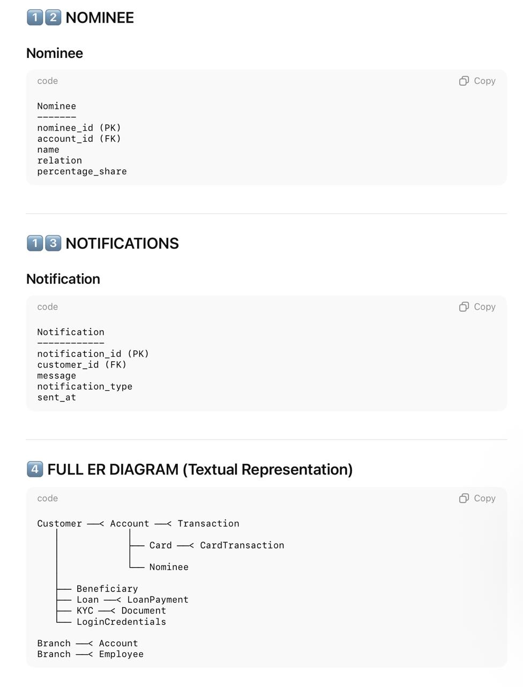

# BBank

A production-style banking backend built with Spring Boot 3, Spring Security, JWT authentication, Spring Data JPA, and PostgreSQL. The project demonstrates a structured approach to financial business workflows, authentication, authorization, validation, persistence, and API design.

> **Project note:** This README documents the repository as implemented. Where the repository does not expose enough information to verify a detail, it is explicitly described as not documented rather than invented.

## What the Project Does

BBank provides backend APIs for common banking operations. The implemented workflows include user registration and login, account management, deposits, withdrawals, fund transfers, beneficiaries, transaction history, and administrator account controls.

The project is designed around protected REST APIs and a layered Spring Boot architecture so that authentication, business rules, persistence, and HTTP concerns remain separated.

### Main workflows

**Customer workflow**

1. Register a user.
2. Authenticate and receive a JWT.
3. Create and inspect accounts.
4. Deposit and withdraw funds.
5. Transfer funds to another account.
6. Create and view beneficiaries.
7. Retrieve transaction history.

**Admin workflow**

1. View users.
2. View accounts.
3. Freeze an account when required.

## Architecture

The backend follows a conventional layered architecture:

```text
Client
  |
  v
REST Controllers
  |
  v
Services / Service Implementations
  |
  v
Repositories
  |
  v
JPA Entities
  |
  v
PostgreSQL
```

Cross-cutting concerns are separated into dedicated layers/modules:

```text
+-----------------------------+
| Controllers                 |
| HTTP endpoints / contracts  |
+-------------+---------------+
              |
              v
+-----------------------------+
| DTOs                        |
| Request / response models   |
+-------------+---------------+
              |
              v
+-----------------------------+
| Services                    |
| Business rules              |
+-------------+---------------+
              |
              v
+-----------------------------+
| Repositories                |
| Spring Data JPA             |
+-------------+---------------+
              |
              v
+-----------------------------+
| PostgreSQL                  |
+-----------------------------+

Security -> Spring Security + JWT filter/authentication
Validation -> Spring Boot Validation
Errors -> Centralized exception handling
```

The existing project structure is documented as using `controller`, `service`, `service.impl`, `repository`, `dto`, `entity`, `security`, and `exception` responsibilities.

## Technologies

| Technology | Purpose |
|---|---|
| Java 17 | Application runtime and language |
| Spring Boot 3.4.2 | Backend application framework |
| Spring Web | REST API layer |
| Spring Security | Authentication and authorization |
| JJWT 0.12.6 | JWT creation/validation support |
| Spring Data JPA | ORM and repository abstraction |
| Hibernate | JPA persistence implementation |
| PostgreSQL | Relational database |
| Maven | Dependency and build management |
| Lombok | Boilerplate reduction |
| Docker | Containerized application packaging |

The Maven build and runtime configuration confirm Java 17, Spring Boot 3.4.2, Spring Security, Spring Data JPA, PostgreSQL, JJWT 0.12.6, and Lombok. The application is configured for PostgreSQL rather than MySQL.

## Features

### Authentication and authorization

- User registration
- User login
- JWT-based authentication
- Protected API endpoints
- Role-based access for customer and administrator flows

### Account operations

- Create accounts
- Retrieve account information
- Deposit funds
- Withdraw funds
- Transfer funds between accounts
- Account freeze control for administrators

### Beneficiary management

- Create beneficiaries
- Retrieve beneficiaries

### Transactions

- Retrieve account transaction history
- Paginated transaction history endpoint

### API quality and backend design

- DTO-based request/response contracts
- Request validation
- Centralized exception handling
- Layered service/repository design
- Docker support

## API Documentation

Base URL for local execution:

```text
http://localhost:8080
```

### Authentication

| Method | Endpoint | Purpose | Auth |
|---|---|---|---|
| `POST` | `/auth/register` | Register a new user | Public |
| `POST` | `/auth/login` | Authenticate a user and obtain a JWT | Public |

### Accounts

| Method | Endpoint | Purpose | Auth |
|---|---|---|---|
| `POST` | `/accounts` | Create an account | JWT |
| `GET` | `/accounts` | List/retrieve accounts | JWT |
| `GET` | `/accounts/{accountNumber}` | Get account details | JWT |
| `POST` | `/accounts/{accountNumber}/deposit` | Deposit funds | JWT |
| `POST` | `/accounts/{accountNumber}/withdraw` | Withdraw funds | JWT |
| `POST` | `/accounts/{accountNumber}/transfer` | Transfer funds | JWT |
| `GET` | `/accounts/{accountNumber}/transactions?page=0&size=10` | Get paginated transaction history | JWT |

### Beneficiaries

| Method | Endpoint | Purpose | Auth |
|---|---|---|---|
| `POST` | `/beneficiaries` | Create a beneficiary | JWT |
| `GET` | `/beneficiaries` | Retrieve beneficiaries | JWT |

### Administration

| Method | Endpoint | Purpose | Auth |
|---|---|---|---|
| `GET` | `/admin/users` | Retrieve users | Admin |
| `GET` | `/admin/accounts` | Retrieve accounts | Admin |
| `PATCH` | `/admin/accounts/{accountNumber}/freeze` | Freeze an account | Admin |

> Exact JSON request/response schemas are not reproduced here because the repository metadata available for this documentation pass did not expose the controller DTO definitions reliably. The endpoint inventory above is based on the project's existing README and documented application surface.

## Database Design

BBank uses PostgreSQL with Spring Data JPA/Hibernate for persistence.

At a domain level, the system revolves around these concepts:

```text
User
 |
 +----< Account
           |
           +----< Transaction

User
 |
 +----< Beneficiary
```

### Core domain responsibilities

| Domain | Responsibility |
|---|---|
| User | Identity, authentication, and role association |
| Account | Bank account details and account state |
| Transaction | Financial movement/history linked to an account |
| Beneficiary | Saved transfer destination associated with a user |

### Persistence configuration

The application is configured with:

```properties
spring.datasource.url=${SPRING_DATASOURCE_URL}
spring.datasource.username=${SPRING_DATASOURCE_USERNAME}
spring.datasource.password=${SPRING_DATASOURCE_PASSWORD}
spring.datasource.driver-class-name=org.postgresql.Driver
spring.jpa.hibernate.ddl-auto=update
spring.jpa.open-in-view=false
```

`ddl-auto=update` means Hibernate is expected to update the database schema from the mapped entities during development/runtime. For production database lifecycle management, a dedicated migration strategy such as Flyway or Liquibase would be preferable.

## Security

Security is built around Spring Security and JWT authentication.

### Implemented security controls

- JWT-based authentication
- Protected endpoints
- Role-based authorization for customer/admin flows
- Validation support through Spring Boot Validation
- Centralized exception handling
- Database credentials supplied through environment variables
- `open-in-view` disabled for cleaner transaction boundaries

### JWT configuration

The application configures a 24-hour token expiration:

```properties
app.jwt.expiration-ms=86400000
```

### Important security hardening

The repository currently contains a JWT secret value in `application.properties`. That secret should be treated as compromised if this repository is public. Move the JWT secret to an environment variable or secrets manager, rotate the exposed value, and avoid committing credentials or signing keys to source control.

For production banking workloads, add further controls such as refresh-token rotation, rate limiting, audit logging, idempotency for financial commands, stricter transactional/concurrency controls, database migrations, secret management, and comprehensive security/integration testing.

## Setup Instructions

### Prerequisites

- Java 17+
- PostgreSQL
- Git
- Docker (optional)

### 1. Clone the repository

```bash
git clone https://github.com/SubratRai/BBank.git
cd BBank
```

### 2. Create/configure PostgreSQL

Create a PostgreSQL database and user, then provide the connection details through environment variables:

```bash
export SPRING_DATASOURCE_URL='jdbc:postgresql://localhost:5432/bbank'
export SPRING_DATASOURCE_USERNAME='postgres'
export SPRING_DATASOURCE_PASSWORD='your-password'
```

### 3. Run with Maven

Using the Maven wrapper:

```bash
./mvnw spring-boot:run
```

The application defaults to port `8080`, or uses the `PORT` environment variable when supplied.

### 4. Build the application

```bash
./mvnw clean package
```

### 5. Run with Docker

The repository includes a Dockerfile based on Eclipse Temurin 17. Build and run it with:

```bash
docker build -t bbank .
docker run --rm -p 8080:8080 \
  -e SPRING_DATASOURCE_URL='jdbc:postgresql://host.docker.internal:5432/bbank' \
  -e SPRING_DATASOURCE_USERNAME='postgres' \
  -e SPRING_DATASOURCE_PASSWORD='your-password' \
  bbank
```

## Screenshots

The repository includes nine banking application screenshots. They can be viewed directly from the repository:

| Preview | File |
|---|---|
| Banking screen 1 | [`bank1.jpeg`](./bank1.jpeg) |
| Banking screen 2 | [`bank2.jpeg`](./bank2.jpeg) |
| Banking screen 3 | [`bank3.jpeg`](./bank3.jpeg) |
| Banking screen 4 | [`bank4.jpeg`](./bank4.jpeg) |
| Banking screen 5 | [`bank5.jpeg`](./bank5.jpeg) |
| Banking screen 6 | [`bank6.jpeg`](./bank6.jpeg) |
| Banking screen 7 | [`bank7.jpeg`](./bank7.jpeg) |
| Banking screen 8 | [`bank8.jpeg`](./bank8.jpeg) |
| Banking screen 9 | [`bank9.jpeg`](./bank9.jpeg) |

For GitHub's README rendering, you can also place selected previews directly on the page once the UI screens are finalized, for example:

```markdown

```

## Example API Requests

The following examples show the documented API surface. Field names should be aligned with the actual DTO contracts before using them as executable copy/paste requests.

### Register

```bash
curl -X POST http://localhost:8080/auth/register \
  -H 'Content-Type: application/json' \
  -d '{
    "name": "Demo User",
    "email": "demo@example.com",
    "password": "StrongPassword123"
  }'
```

### Login

```bash
curl -X POST http://localhost:8080/auth/login \
  -H 'Content-Type: application/json' \
  -d '{
    "email": "demo@example.com",
    "password": "StrongPassword123"
  }'
```

Store the returned JWT and use it as a bearer token for protected endpoints:

```bash
export TOKEN='your-jwt-token'
```

### Create account

```bash
curl -X POST http://localhost:8080/accounts \
  -H 'Authorization: Bearer '"$TOKEN" \
  -H 'Content-Type: application/json' \
  -d '{}'
```

### Deposit

```bash
curl -X POST http://localhost:8080/accounts/123456789/deposit \
  -H 'Authorization: Bearer '"$TOKEN" \
  -H 'Content-Type: application/json' \
  -d '{
    "amount": 1000
  }'
```

### Withdraw

```bash
curl -X POST http://localhost:8080/accounts/123456789/withdraw \
  -H 'Authorization: Bearer '"$TOKEN" \
  -H 'Content-Type: application/json' \
  -d '{
    "amount": 250
  }'
```

### Transfer

```bash
curl -X POST http://localhost:8080/accounts/123456789/transfer \
  -H 'Authorization: Bearer '"$TOKEN" \
  -H 'Content-Type: application/json' \
  -d '{
    "toAccountNumber": "987654321",
    "amount": 500
  }'
```

### Transaction history

```bash
curl 'http://localhost:8080/accounts/123456789/transactions?page=0&size=10' \
  -H 'Authorization: Bearer '"$TOKEN"
```

### Freeze an account as admin

```bash
curl -X PATCH http://localhost:8080/admin/accounts/123456789/freeze \
  -H 'Authorization: Bearer '"$TOKEN"
```

## Project Structure

```text
BBank/
├── src/main/java/
│   └── ...
│       ├── controller/
│       ├── service/
│       ├── service/impl/
│       ├── repository/
│       ├── dto/
│       ├── entity/
│       ├── security/
│       └── exception/
├── src/main/resources/
│   └── application.properties
├── Dockerfile
├── Procfile
├── mvnw
├── pom.xml
└── README.md
```

## Engineering Notes

The repository is intentionally structured as a backend-first application rather than a collection of isolated CRUD endpoints. Financial workflows are represented through domain-specific services and persisted with JPA, while authentication and authorization are separated behind Spring Security/JWT infrastructure.

For production deployment, the next engineering priorities would be secret rotation, database migrations, stronger transaction/concurrency guarantees for money movement, auditability, automated integration tests, API schema generation, and observability.

## License

No license file is currently documented in the repository metadata inspected for this README update.